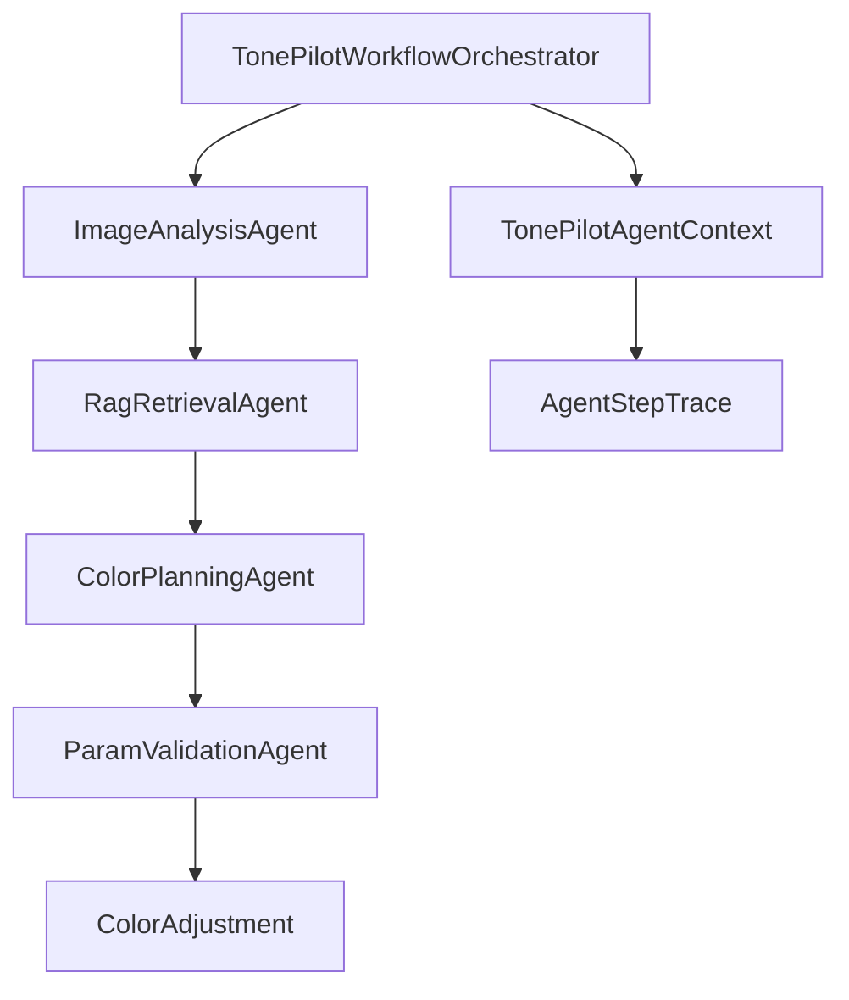

# TonePilot 架构说明

## 产品边界

TonePilot 分为两个产品端：

- 插件端：Lightroom Classic 用户端。用户在 Lightroom 中选中照片，通过本地 Agent 对话修图。
- 管理端：云端 Web 管理端。管理员维护风格知识库、样片、Prompt、规则、配置、用户设备、会话、Trace、工具调用和评估数据。

管理端不直接控制用户本地 Lightroom，也不是用户日常修图的强依赖。真实修图发生在 Lightroom 插件和 TonePilot Local Runtime 中，最终效果以 Lightroom Classic 当前照片的 Develop Settings 为准。

## 推荐部署链路

```text
Lightroom Classic 插件
  -> TonePilot Local Runtime（本地 Java Agent）
      -> 本地规则 / 用户配置的大模型 / 可选管理端模型代理
      -> Lightroom 文件桥接任务
  -> TonePilot Admin（云端管理端）
      -> 用户、设备、知识库、配置、会话、Trace、工具调用记录
      -> MySQL / Redis / 对象存储
```

## 插件端链路

```mermaid
flowchart LR
  A["Lightroom 当前选中照片"] --> B["Lua 插件读取照片信息和 Develop 参数"]
  B --> C["selected-photo.json / selected-preview.jpg"]
  C --> D["Java Local Runtime"]
  D --> E["Agent 控制台"]
  E --> F["用户输入调色意图"]
  F --> G["意图分析 / 照片类型判断 / 调色策略规划"]
  G --> H["本地规则 / OpenAI / Qwen / 管理端模型代理"]
  H --> I["生成本轮 Develop Settings"]
  I --> J["参数校验和 diff"]
  J --> K["写入 apply-jobs"]
  K --> L["Lua 插件 applyDevelopSettings"]
  L --> M["Lightroom 显示真实调色结果"]
```



Lightroom 自身负责实时预览、撤销、保存和复制设置。TonePilot 只生成参数决策，并通过插件落地到当前照片。

## Local Runtime 职责

Local Runtime 是用户端 Agent 主体，不只是任务下发器。它负责：

- 读取 Lightroom 当前选中照片、元信息、预览图和当前 Develop Settings。
- 维护当前照片的多轮交互上下文。
- 分析用户意图、照片类型和修图方向。
- 使用本地规则、用户配置的大模型或管理端模型代理生成本轮调色参数。
- 校验参数范围，只输出本轮需要修改的 Develop Settings。
- 写入 Lightroom 文件桥接任务，并等待插件应用结果。
- 返回 Agent 回复、参数变化、应用结果和预览地址。
- 可选上报管理端事件和 Trace。

当前 Java Runtime 核心模块：

- `config/`：运行时端口、桥接目录、管理端地址、本机模型配置。
- `bridge/`：Lightroom 文件桥接路径、当前照片读取、调色任务写入。
- `agent/`：本地规则 Agent 和运行时编排。
- `admin/`：管理端事件上报客户端。
- `api/`：本地 HTTP API 和 Agent 控制台入口。

## 管理端职责

管理端是云端控制面和数据中心，负责：

- 用户和设备注册。
- 风格知识库、样片、Prompt、规则、模型配置管理。
- 运行时会话、消息、Trace、LLM 调用、Lightroom 工具调用记录。
- 自动评估、统计分析和可观测性。
- MySQL、Redis、MinIO / OSS 等服务端存储。

管理端可以提供可选模型代理，但实时修图闭环仍由本地 Runtime 编排和执行。

## 管理端多 Agent 工作流

管理端后端保留可控状态机式多 Agent，用于知识库、样片分析、评估和服务端流程，而不是开放自治 Agent。



节点职责：

- `ImageAnalysisAgent`：识别场景、主体、曝光、白平衡和色彩问题。
- `RagRetrievalAgent`：按场景和目标风格检索知识库 topK 片段。
- `ColorPlanningAgent`：生成 Lightroom 参数。
- `ParamValidationAgent`：校验参数范围并收敛过激调整。

## 上下文控制

系统分三层控制上下文：

- 本地修图上下文：当前照片、当前参数、用户多轮意图和本轮参数 diff，由 Local Runtime 管理。
- 管理端工作流上下文：`runId`、照片、供应商、目标风格、中间结果和 trace，由管理端工作流管理。
- 长期知识上下文：知识留在库里，运行时或管理端按需检索 topK 片段。

管理端 `WorkflowRunRepository` 优先写 Redis，同时写数据库快照，并保留本地缓存兜底。Local Runtime 不使用 SQLite，不直接连 MySQL/Redis。

## 数据与存储

开发环境：

- H2 文件数据库：可用于管理端本地开发。
- MySQL：生产形态关系数据库。
- Redis：管理端分布式上下文、trace 和缓存。
- MinIO / OSS：对象存储。

插件端：

- `~/.tonepilot-lightroom-bridge`：Lightroom 文件桥接目录。
- `runtime-config.json`：本机模型配置。
- `selected-photo.json`、`selected-preview.jpg`、`apply-jobs`、`apply-results`：插件和 Runtime 的临时协作文件。

## 可观测性与评估

管理端保存：

- LLM 调用日志：provider、model、用途、耗时、成功状态、错误摘要。
- 审计事件：调色、benchmark、鉴权失败、限流等。
- Runtime 事件：设备注册、会话消息、Agent 输出、Lightroom 工具调用结果。
- 自动 benchmark：按 provider 跑固定样本集，评估参数范围、说明完整度和异常情况。

## 主要接口

Local Runtime：

- `GET /status`
- `GET /agent-console`
- `GET /api/lightroom/selected-photo`
- `GET /api/runtime/config`
- `POST /api/runtime/config`
- `POST /api/lightroom-agent/chat`

管理端 Runtime 接入：

- `POST /api/runtime/devices/register`
- `POST /api/runtime/events`
- `GET /api/runtime/events?userId=...`

管理端：

- `/api/admin/styles`
- `/api/admin/style-samples`
- `/api/admin/knowledge`
- `/api/knowledge`
- `/api/observability/llm-calls`
- `/api/observability/audit-events`
- `/api/evaluation/benchmark`
