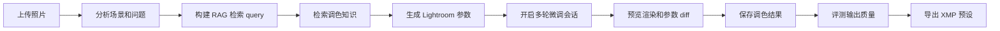
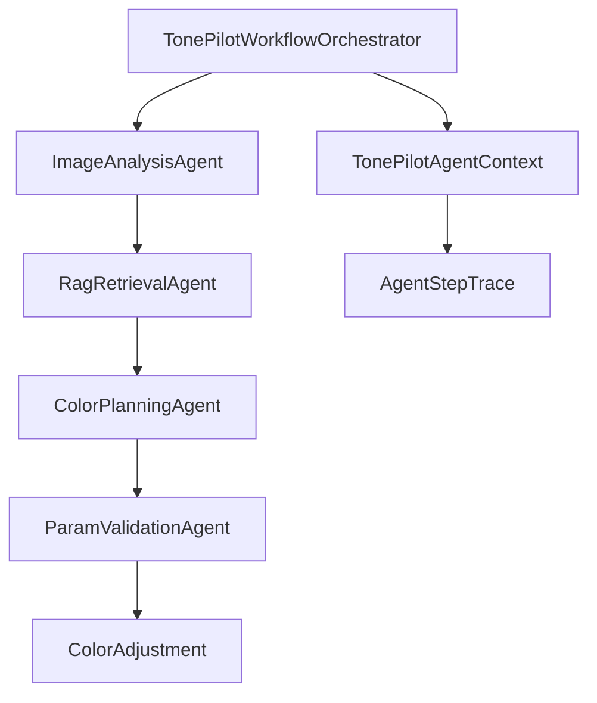
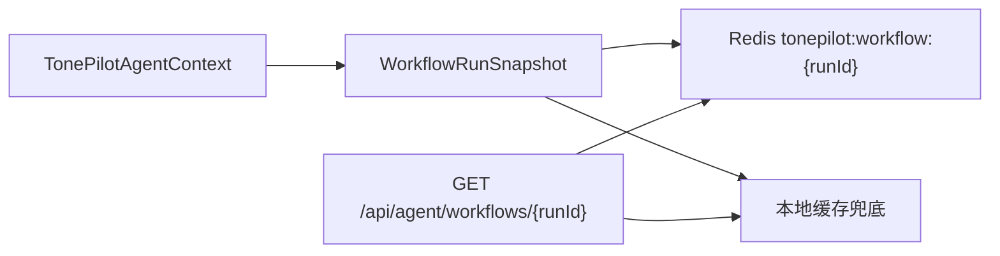
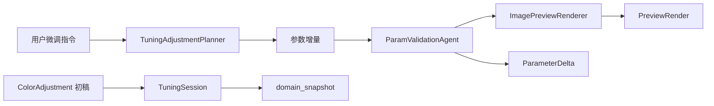
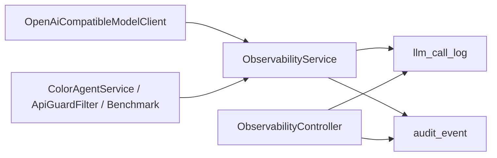
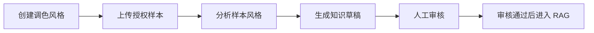
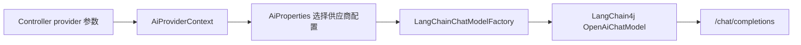
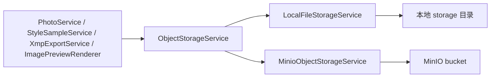

# TonePilot 架构说明

## 产品边界

TonePilot 的 MVP 不用生成式 AI 造图。系统负责生成可解释的 Lightroom 参数决策，并提供项目内置预览渲染，帮助用户在页面上判断调色方向；生产级精修仍以保存后的参数、XMP 或 Lightroom 外部连接器为准。

## 用户端核心链路



## 用户端多 Agent 工作流

TonePilot 的用户端调色链路采用可控状态机多 Agent，而不是开放自治型 Agent。中心编排器负责顺序、条件、重试和检查点；单个 Agent 只负责一个明确职责。



当前节点职责：

- `ImageAnalysisAgent`：生成场景、主体、曝光、白平衡和色彩问题摘要。
- `RagRetrievalAgent`：根据照片分析和目标风格构建 query，只取 topK 知识片段。
- `ColorPlanningAgent`：结合照片分析和 RAG 知识生成 Lightroom 参数。
- `ParamValidationAgent`：检查曝光、基础参数、HSL 和效果参数，并把越界值收敛到安全范围。

每个节点实现统一 `AgentNode` 接口，编排器按 `order` 顺序执行节点。每个节点执行后都会写入 `AgentStepTrace`，包含节点名、Agent 名、状态、耗时、尝试次数、输入摘要、输出摘要和错误信息。`WorkflowRunRepository` 会优先把快照写入 Redis，同时写入数据库，并保留本地缓存兜底。

## 上下文控制

`TonePilotAgentContext` 是一次调色运行的全局上下文，但它不是直接塞给大模型的 prompt。系统采用三层上下文控制：

- 运行上下文：保存 `runId`、`photoId`、`provider`、`targetStyle`、中间结果、校验结果和 trace。
- Agent 输入视图：每个 Agent 只读取需要的字段，例如调色规划只读取照片分析摘要、目标风格和 RAG 命中。
- 长期知识上下文：风格知识留在知识库中，运行时只检索 topK 片段，避免上下文膨胀。

这样可以让链路具备多 Agent 可追踪性，同时避免开放式 Agent 带来的不可控上下文扩散。

## Redis 工作流检查点

工作流上下文通过 `WorkflowRunRepository` 保存：



Redis 用于分布式内存和跨实例查询，默认 TTL 为 24 小时。Redis 不可用时，写入和读取会自动降级到数据库和本地缓存，避免开发环境因为基础设施未启动而中断。

## 多轮调色会话

多轮微调由 `TuningSessionService` 管理，它不替代前面的多 Agent 参数生成，而是在第一版参数之上做持续交互：



核心规则：

- 会话消息、当前参数草稿、最新参数变化和预览图地址都会写入 `domain_snapshot`。
- 用户每次微调后都会得到新的草稿参数，保存前不生成新的 `adjustmentId`，避免评测或导出误用旧参数。
- 保存会话会创建新的 `ColorAdjustment`，之后可以继续进入评测和 XMP 导出。
- 预览图通过 `ObjectStorageService.writeBinaryFile` 写入本地存储或 MinIO，统一以 `/files/previews/...` 暴露。

`ImagePreviewRenderer` 使用 Java2D 做近似预览，覆盖曝光、对比、阴影/高光、色温、色调、饱和度、暗角和颗粒等常用参数。它的目标是快速反馈调色方向，不声明与 Lightroom 渲染引擎完全一致。

## Lightroom 连接器

`lightroom` 包定义了 `LightroomConnector` 和状态对象。默认实现 `NoopLightroomConnector` 返回 `tonepilot-native-preview`，表示当前使用 TonePilot 内置预览。

本地 Lightroom Classic 不作为普通 HTTP API 直接被 WSL/Spring Boot 调用。后续可落地的真实联动方式有两类：

- Lightroom Classic Lua 插件桥接：插件运行在本机 Lightroom Classic 内，监听 TonePilot 发送的参数并调用 Develop 能力，再导出渲染结果。
- XMP 热文件夹桥接：TonePilot 写入 XMP，Lightroom 负责导入、应用和导出。

Lightroom 云 API 更适合 Creative Cloud catalog 和云端资源集成，不等同于直接控制用户电脑上的 Lightroom Classic。

## 数据库持久化

默认使用 H2 文件数据库，生产环境可通过 `TONEPILOT_DB_URL` 切换到 MySQL。当前数据库持久化覆盖：

- `workflow_run_snapshot`：工作流完整快照。
- `llm_call_log`：LLM 调用日志。
- `audit_event`：审计事件。
- `domain_snapshot`：照片、照片分析、调色方案等领域对象 JSON 快照。

`DomainSnapshotBootstrap` 会在应用启动后恢复照片、分析和调色方案的 ID 水位，避免服务重启后 ID 回退覆盖旧数据。

## 可观测性



当前记录：

- LLM provider、model、任务类型、耗时、成功状态、错误信息。
- Prompt 和响应摘要，避免把完整图片或超长上下文写入日志。
- 工作流 runId，用于把模型调用和 Agent trace 关联起来。
- 调色生成、benchmark、鉴权失败、限流等审计事件。

## 自动评测

`BenchmarkEvaluationService` 内置固定评测样本集，支持按 provider 跑回归评测：

```text
POST /api/evaluation/benchmark
```

评测维度包括参数范围、reason/steps 完整度、异常捕获和平均分。没有配置密钥的大模型供应商会沿用既有 fallback 机制，不会中断 benchmark。

## 生产治理

当前已实现：

- 可选 API Key 鉴权，使用 `X-TonePilot-Api-Key`。
- IP 维度基础限流。
- 鉴权失败和限流事件写入审计日志。
- 默认开发环境不开启 API Key，避免影响本地调试。

## 管理端核心链路



## 可替换适配器

MVP 默认使用基于规则的本地适配器，让应用在没有模型密钥的情况下也能完整运行：

- `ImageAnalysisAgent`：后续可替换为多模态图片分析模型调用。
- `StyleAnalysisAgent`：后续可替换为多模态风格分析模型调用。
- `ColorPlanningAgent`：后续可替换为 LangChain4j 的结构化输出链路。
- `RagService`：后续可把文本打分替换为向量检索。
- `InMemoryTonePilotStore`：后续可替换为 MyBatis-Plus 仓储和向量库 id 映射。

## 大模型供应商切换

后端通过 `OpenAiCompatibleModelClient` 统一封装 OpenAI Chat Completions 兼容接口。真实模型调用由 LangChain4j 的 `OpenAiChatModel` 完成，文本任务和图片多模态分析共用同一套供应商配置。



当前支持三种供应商：

- `rule`：本地规则版，不发起网络请求。
- `openai`：OpenAI 官方接口。
- `qwen2`：阿里通义千问 OpenAI 兼容模式。

如果模型接口调用失败，并且开启了回退配置，Agent 会自动使用本地规则版结果。

## 对象存储切换

照片、样本、XMP 文件和调色预览图统一走 `ObjectStorageService`。当前提供两种实现：

- `LocalFileStorageService`：开发默认值，写入后端本地 `storage/` 目录。
- `MinioObjectStorageService`：使用 MinIO 作为本地 OSS 模拟环境。

业务层只依赖 `ObjectStorageService`，不会感知具体存储后端。



对外文件地址保持 `/files/**`。本地模式由 Spring 静态资源直接读取磁盘；MinIO 模式由 `StoredFileController` 代理读取对象，前端无需关心后端存储类型。

## 数据模型

用户端核心表：

- `photo`
- `photo_analysis`
- `color_knowledge`
- `color_adjustment`
- `xmp_export`

管理端核心表：

- `color_style`
- `style_sample`
- `style_knowledge`

Java 领域记录与这些表结构保持接近，后续迁移到 MySQL 时可以直接映射。

## 后续增强

- 把 `domain_snapshot` 进一步拆成规范化业务表，便于复杂查询和报表。
- 接入真实向量库，替换当前文本打分 RAG。
- 接入 OpenTelemetry 或 Langfuse，提供更完整的 trace 可视化。
- 增加用户体系、RBAC 和多租户隔离。
- 增加异步任务队列，支持长耗时多模型评测和批量处理。
