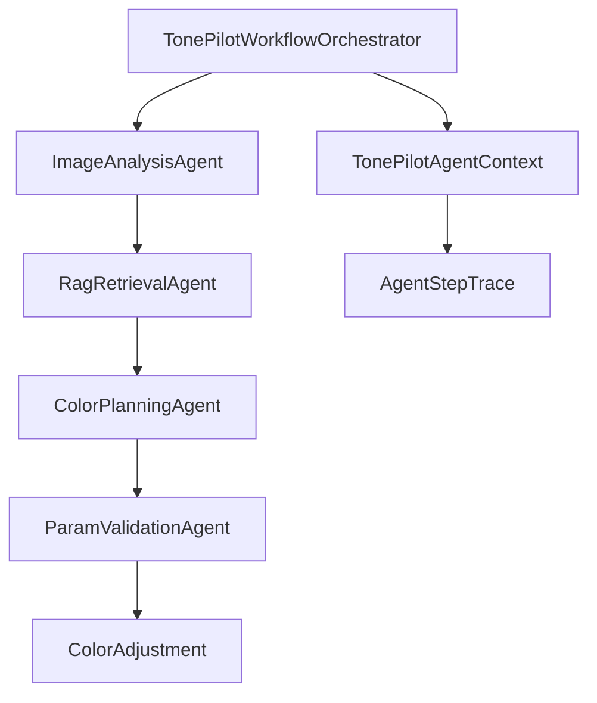
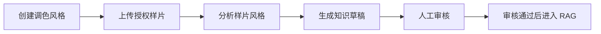
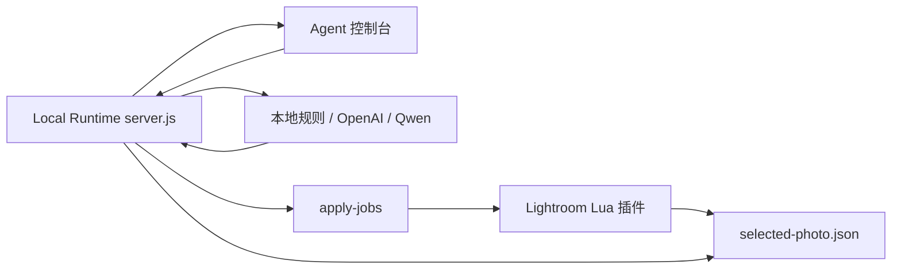

# TonePilot 架构说明

## 产品边界

TonePilot 保留两个产品端：

- 管理端：Web 管理台，维护风格、样片、知识库、审核、观测和评测。
- 插件端：Lightroom Classic 用户端，摄影师直接在 Lightroom 中对话修图。

管理端后端不再做浏览器用户修图工作台，不维护旧 `/api/tuning` 会话，不做 Java2D 图片预览渲染，也不把 XMP 导出作为主要交付方式。用户修图发生在 Lightroom 插件端和 TonePilot Local Runtime 中；真实效果以 Lightroom Classic 当前照片的 Develop Settings 为准。

## 插件端链路

```mermaid
flowchart LR
  A["Lightroom 当前选中照片"] --> B["Lua 插件读取照片信息和 Develop 参数"]
  B --> C["Local Runtime Agent 控制台"]
  C --> D["用户输入调色指令"]
  D --> E["本地规则或 OpenAI/Qwen"]
  E --> F["Local Runtime 生成参数"]
  F --> G["参数 diff 和 Develop Settings"]
  G --> H["Local Runtime 写入任务文件"]
  H --> I["Lua 插件 applyDevelopSettings"]
  I --> J["Lightroom 显示真实调色结果"]
```



Lightroom 自身负责实时预览、撤销、保存和复制设置。TonePilot 只生成参数决策。

## 管理端 Agent 工作流

后端采用可控状态机式多 Agent，而不是开放自治 Agent。中心编排器负责顺序、条件、重试和 trace，单个 Agent 只承担明确职责。



节点职责：

- `ImageAnalysisAgent`：识别场景、主体、曝光、白平衡和色彩问题。
- `RagRetrievalAgent`：按场景和目标风格检索知识库 topK 片段。
- `ColorPlanningAgent`：生成 Lightroom 参数。
- `ParamValidationAgent`：校验参数范围并收敛过激调整。

插件端多轮微调在 `clients/lightroom-classic/local-runtime` 中完成。Local Runtime 不是云端后端，而是摄影师本机的轻量执行器，核心模块为：

- `src/bridge-runtime.js`：读取 Lightroom 插件写入的照片状态，提供 Agent 控制台和本地 HTTP API。
- `src/local-rule-agent.js`：无模型密钥时的离线规则 Agent。
- `src/model-agent.js`：OpenAI / Qwen 的 OpenAI 兼容接口适配。
- `src/runtime-config.js`：本机模型供应商、模型名和 API Key 配置。
- `test/`：验证本地运行时协议、规则、模型适配和插件入口。

插件端每轮返回：

- `assistantMessage`：给用户看的 Agent 回复。
- `runtimeProvider`：本轮实际使用的本地规则、OpenAI 或 Qwen。
- `deltas`：本轮参数变化、原值、新值、变化量和原因。
- `developSettings`：可直接传给 Lightroom `photo:applyDevelopSettings` 的参数。

## 上下文控制

系统分三层控制上下文：

- 运行上下文：`runId`、照片、供应商、目标风格、中间结果和 trace。
- Agent 输入视图：每个 Agent 只读取自己需要的字段，避免把全量上下文塞进 prompt。
- 长期知识上下文：知识留在库里，运行时只检索 topK 片段。

`WorkflowRunRepository` 优先写 Redis，同时写数据库快照，并保留本地缓存兜底。Redis 不可用时，开发流程不会中断。

## 管理端链路



管理端页面包括：

- 风格库：维护风格名称、编码、描述和适用场景。
- 知识库：新增调色知识，审核、拒绝或禁用知识。
- 样片管理：上传管理员样片，分析样片并生成知识草稿。
- 观测评估：查看 LLM 调用、审计事件，运行 benchmark。

管理端工程统一放在 `tonepilot-admin`：

```text
tonepilot-admin/
├── backend/   Spring Boot 管理端后端
└── frontend/  Vue 3 管理端前端
```

## Lightroom Classic 客户端

Lightroom Classic 用户端放在 `clients/lightroom-classic`，结构上接近 Neurapix 这类 Lightroom AI 插件：插件负责入口和本机执行，TonePilot Local Runtime 负责本地通信、模型配置、规则兜底和参数生成。管理端后端仅提供可选的云端知识和样片能力。

```text
clients/lightroom-classic/
├── local-runtime/     本地运行时、Agent 控制台、安装脚本和测试
│   ├── server.js
│   └── src/bridge-runtime.js
└── plugin/     Lightroom Classic Lua 插件源码
```

Lightroom Classic 插件运行在 Windows Lightroom 进程内，本地 Local Runtime 可以运行在 WSL、Windows 或未来单独打包的桌面进程中。



Local Runtime 暴露本地接口：

- `GET /status`
- `GET /api/lightroom/selected-photo`
- `GET /api/runtime/config`
- `POST /api/runtime/config`
- `POST /api/lightroom-agent/chat`
- `GET /agent-console`

后端不需要直接调用本机 Lightroom；真实控制只发生在 Lua 插件内部。

## 数据与存储

默认开发环境：

- H2 文件数据库：保存快照、日志和审计事件。
- 本地文件存储：保存管理端样片等文件。
- 本地规则模式：无密钥也可跑通。

生产形态可替换：

- MySQL：关系数据库。
- Redis：分布式上下文和 trace。
- MinIO / OSS：对象存储。
- OpenAI / Qwen2：真实大模型。

## 可观测与评测

已实现：

- LLM 调用日志：provider、model、用途、耗时、成功状态、错误摘要。
- 审计事件：调色、benchmark、鉴权失败、限流等。
- 自动 benchmark：按 provider 跑固定样本集，评估参数范围、说明完整度和异常情况。

## 主要接口

插件端本地运行时：

- `GET /status`
- `GET /api/lightroom/selected-photo`
- `POST /api/lightroom-agent/chat`
- `GET /api/runtime/config`
- `POST /api/runtime/config`

管理端：

- `/api/admin/styles`
- `/api/admin/style-samples`
- `/api/admin/knowledge`
- `/api/knowledge`

观测评估：

- `/api/observability/llm-calls`
- `/api/observability/audit-events`
- `/api/evaluation/benchmark`
